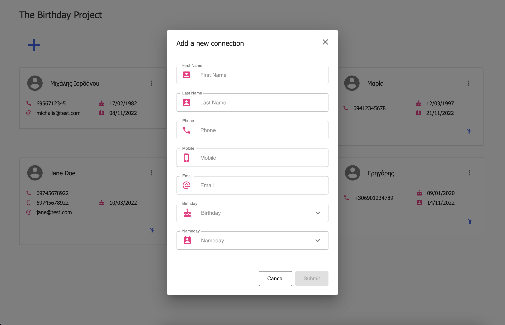
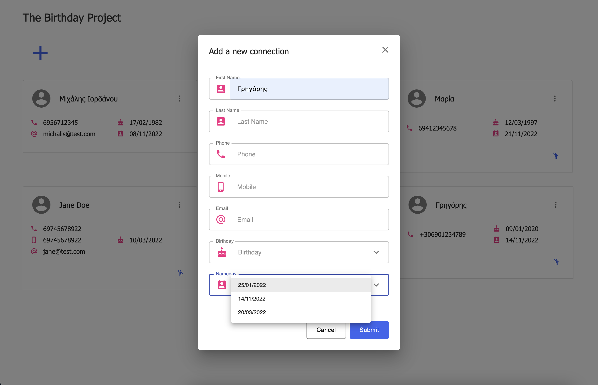
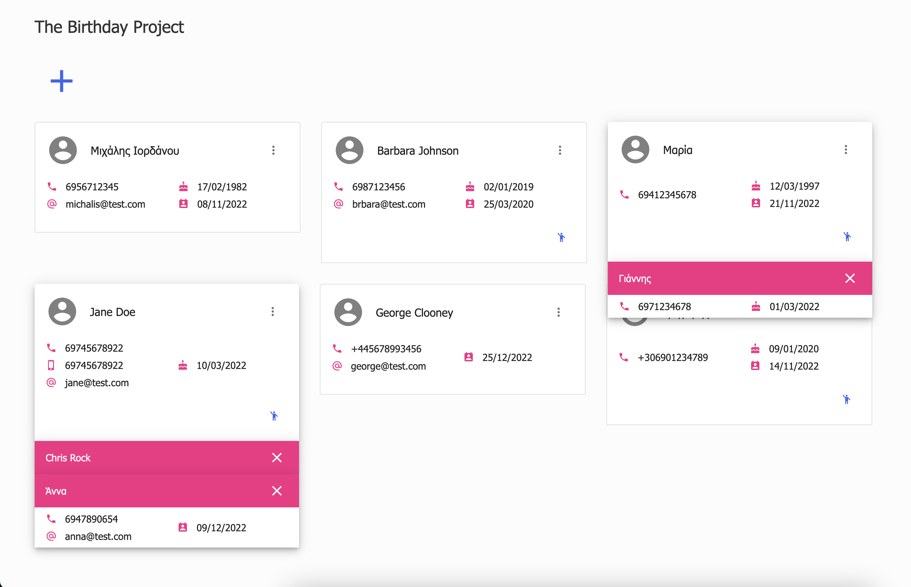
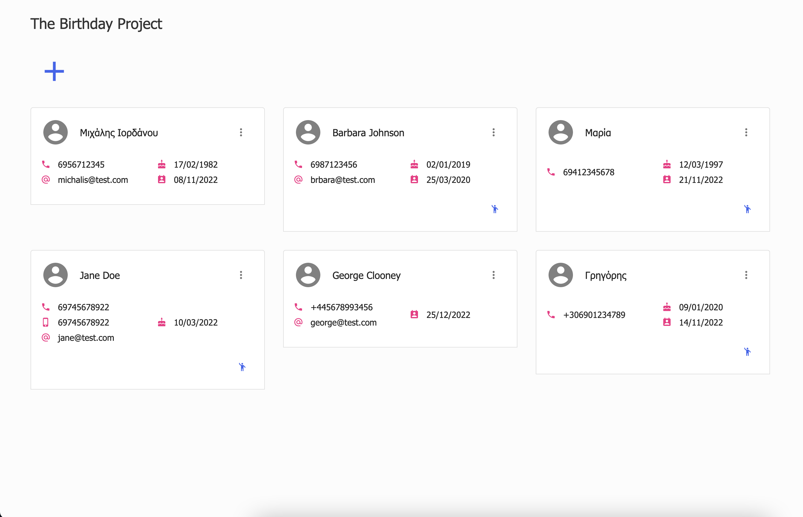

# [The Birthday project](https://github.com/Va5s0/the-birthday-project.git)

## About

If you have many friends with many kids and you constantly forget their birthdays and their namedays and you are ashamed of it, you might find some help here...

All you have to do is add your friend's name and data...

...add all your friend's dependent connections at the same card...

...and store all their birthdays and namedays together! For the Greek names especially, there is an automatic search and a dropdown menu with the possible celebration dates a name might have.

In the end your friend's card will look like this:

...and all your friends cards like this:

React.js - Typescript - Material UI project. Firebase Realtime and Firestore Database CRUD.

## Installation & setup

- Clone this repo
- Run `yarn`
- In order to use the application, you must sign up at https://firebase.google.com/ and request an API access key
- Store your API key at secrets.mine.js inside the token variable and rename the file to secrets.js
- You're all set!

### Development server

- Start the development server with `npm start`
- Point your browser at http://localhost:3000

### Dependencies

- React ^15.4.2
- Flux ^3.1.3
- jQuery ^3.2.1
- react-bootstrap ^0.30.10
- react-dom ^15.4.2

### License

MIT
