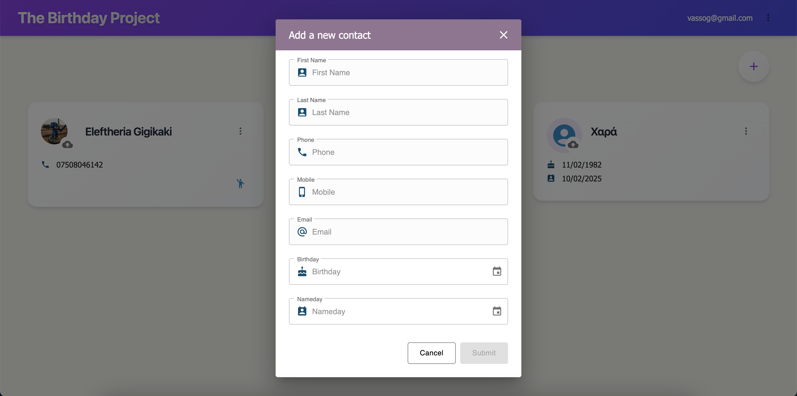
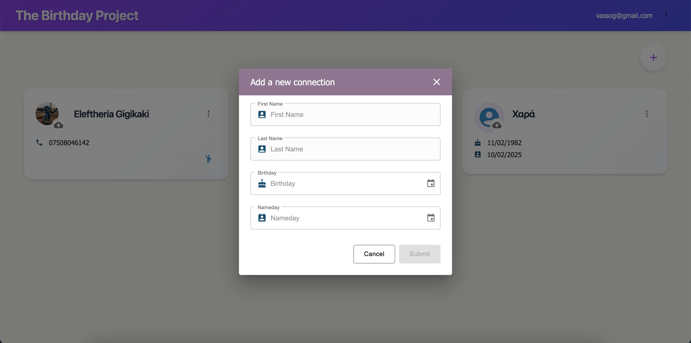
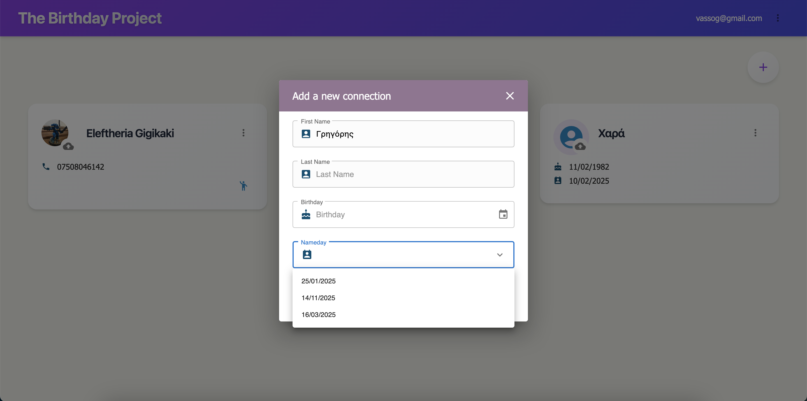
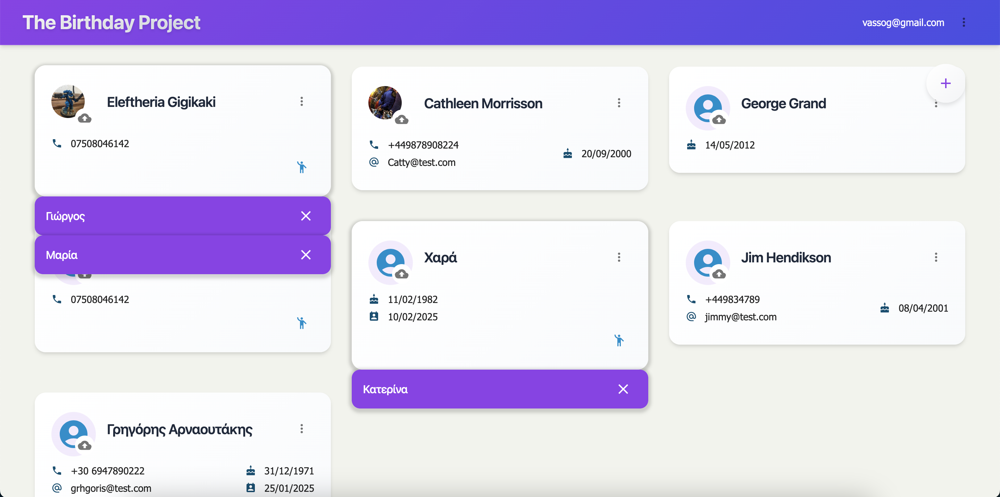
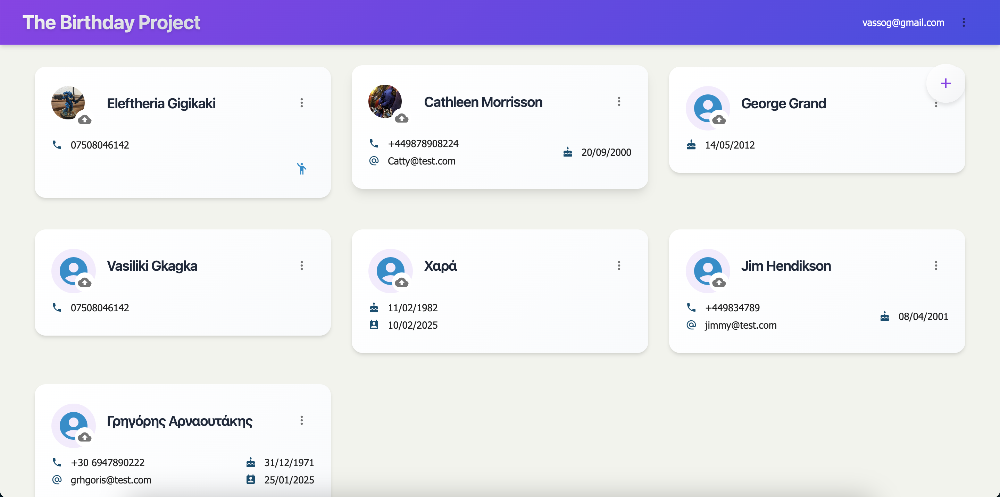

# The Birthday Project

A modern React web application for managing contacts, birthdays, namedays, and user profiles, built with Firebase (Firestore, Storage, Auth), Material-UI, and Emotion CSS.

---

## About

If you have many friends with many kids and you constantly forget their birthdays and their namedays and you are ashamed of it, you might find some help here...

All you have to do is add your friend's name and data...


...add all your friend's dependent connections at the same card...


...and store all their birthdays and namedays together! For the Greek names especially, there is an automatic search and a dropdown menu with the possible celebration dates a name might have.


In the end your friend's card will look like this:


...and all your friends cards like this:


- **User Authentication:** Secure sign-up, login, and logout with Firebase Auth.
- **Profile Management:** Edit your profile, upload/delete avatar, and update personal info.
- **Contacts:** Add, edit, and delete contacts. Each contact can have their own avatar, birthday, nameday, and connections.
- **Namedays:** Search and assign namedays to contacts using a dynamic nameday list.
- **Connections:** Link contacts together (e.g., family, friends).
- **Responsive UI:** Built with Material-UI and Emotion for a modern, mobile-friendly experience.
- **Confirmation Modals & Snackbars:** User-friendly feedback for destructive actions and errors.

---

## Tech Stack

- **React** (with hooks)
- **Firebase** (Firestore, Storage, Auth, Realtime Database)
- **Material-UI** (MUI)
- **Emotion** (CSS-in-JS)
- **TypeScript**

---

## Getting Started

### 1. Clone the repository

```bash
git clone https://github.com/yourusername/the-birthday-project.git
cd the-birthday-project
```

### 2. Install dependencies

```bash
npm install
```

### 3. Configure Firebase

- Create a Firebase project at [firebase.google.com](https://firebase.google.com/).
- Enable **Authentication** (Email/Password).
- Create a **Firestore** database.
- Enable **Storage**.
- Download your Firebase config and place it in `src/firebase/fbConfig.ts`:

```ts
// src/firebase/fbConfig.ts
import { initializeApp } from "firebase/app"
import { getFirestore } from "firebase/firestore"
import { getStorage } from "firebase/storage"
import { getAuth } from "firebase/auth"
import { getDatabase } from "firebase/database"

const firebaseConfig = {
  apiKey: "...",
  authDomain: "...",
  projectId: "...",
  storageBucket: "...",
  messagingSenderId: "...",
  appId: "...",
  databaseURL: "...",
}

const app = initializeApp(firebaseConfig)

export const db = getFirestore(app)
export const storage = getStorage(app)
export const auth = getAuth(app)
export const rldb = getDatabase(app)
```

### 4. Set Firebase Security Rules

#### **Firestore Rules**

```plaintext
rules_version = '2';
service cloud.firestore {
  match /databases/{database}/documents {
    match /users/{userId}/{document=**} {
      allow read, write: if request.auth != null && request.auth.uid == userId;
    }
  }
}
```

#### **Storage Rules**

```plaintext
rules_version = '2';
service firebase.storage {
  match /b/{bucket}/o {
    // User profile picture
    match /users/{userId}/avatar.jpg {
      allow read, write: if request.auth != null && request.auth.uid == userId;
    }
    // Contact avatars
    match /users/{userId}/contacts/{contactId}/avatar.jpg {
      allow read, write: if request.auth != null && request.auth.uid == userId;
    }
  }
}
```

> **Remember to deploy your rules via the Firebase Console or CLI.**

---

## Running the App (with Vite)

```bash
npm start
```

or directly:

```bash
vite
```

This will start Vite’s development server. Open the URL shown in your terminal (usually [http://localhost:3000](http://localhost:3000)).

### Build for production

```bash
npm run build
```

This runs TypeScript type checking and builds the app with Vite.

### Preview the production build

```bash
npm run serve
```

or

```bash
vite preview
```

---

## Contributing

Pull requests are welcome! For major changes, please open an issue first to discuss what you would like to change.

---

## License

This project is licensed under a **custom non-commercial license**:

- **Personal and internal business use only.**
- **Commercial use is prohibited** without prior written permission from the copyright holder.
- **Attribution required** in all copies or substantial portions of the software.
- The software is provided **"as is" without warranty** of any kind.

See the [LICENSE](./LICENSE) file for full details.

---

## Acknowledgements

- [Firebase](https://firebase.google.com/)
- [Material-UI](https://mui.com/)
- [Emotion](https://emotion.sh/)
