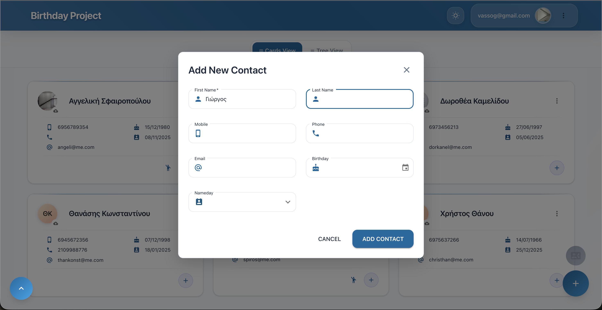
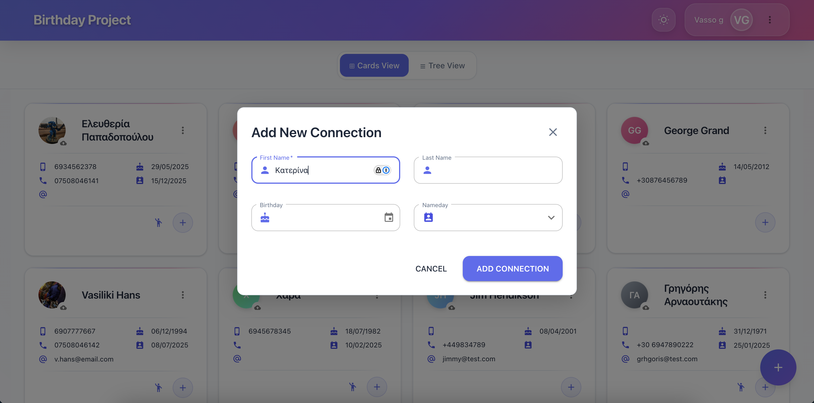
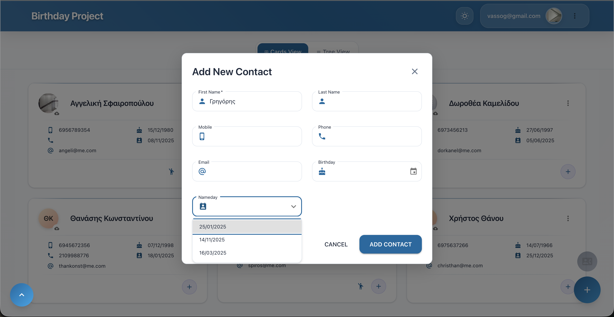
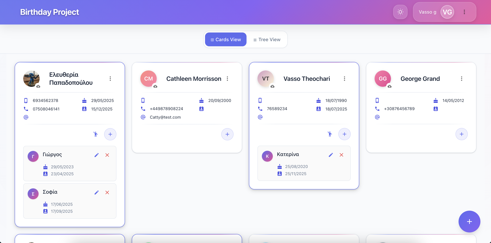
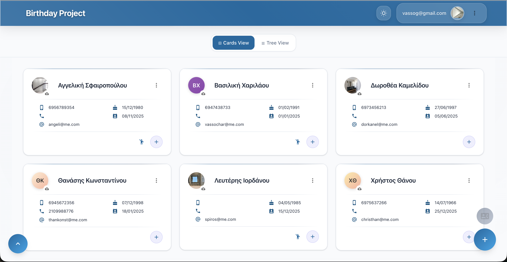
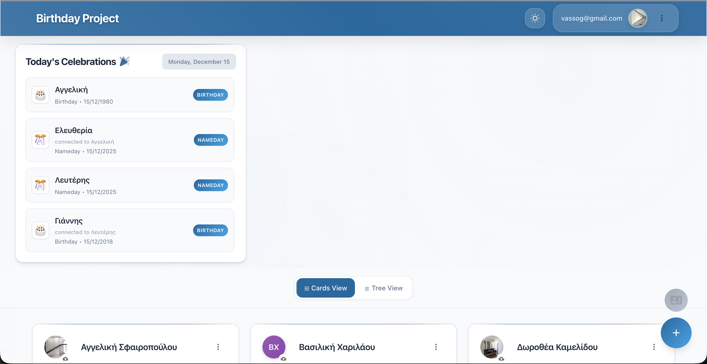

# Birthday Project

_Never forget another birthday again!_ 🎉

A delightfully modern React web application that saves you from the eternal embarrassment of forgetting your friends' birthdays and namedays. Built with love, Firebase, and a healthy dose of "I-really-should-remember-this-stuff" guilt.

---

## 🤦‍♀️ The Problem We All Face

You know that sinking feeling when you realize you forgot your friend's birthday... _again_? 😅

Or worse - you forgot their kid's birthday AND their nameday?

We've all been there. That's why Birthday Project exists!

## 🎯 How It Works (It's Really Simple!)

**Step 1:** Add your friend's info (name, birthday, maybe a cute photo)


**Step 2:** Add their family connections (spouse, kids, pets - we don't judge!)


**Step 3:** Let the magic happen! For Greek names, our smart nameday search finds celebration dates automatically ✨


**Voilà!** Your friend's card now looks professional and you look like you have your life together:


**The Big Picture:** All your friends, beautifully organized:


**Never Miss Another Day:** The Today widget keeps track of what's happening right now:


## ✨ What Makes It Special

- 🔐 **Fort Knox Security:** Your data is locked down tighter than your birthday cake recipe
- 👤 **Pretty Profiles:** Upload avatars, edit info, look good doing it
- 🎭 **Contact Wizardry:** Add, edit, delete contacts with their own birthdays and namedays
- 🇬🇷 **Greek Nameday Magic:** Automatic nameday search because we know you can't remember them all
- 🔗 **Family Connections:** Link people together (because families are complicated)
- 📅 **Today Widget:** See who's celebrating today and upcoming events at a glance
- 📱 **Mobile-Friendly:** Works great on your phone when you're panic-checking dates at 11 PM
- 💬 **No Awkward Moments:** Confirmation modals prevent you from accidentally deleting Uncle George
- 🎨 **Beautiful Design:** Material-UI styling that doesn't look like it's from 2003

---

## 🛠️ Built With

- **React** ⚛️
- **Firebase** 🔥 (Firestore, Storage, Auth, Realtime Database)
- **Material-UI** 💅
- **TypeScript** 📘

---

## 🚀 Getting Started

### 1. Grab the code 📥

```bash
git clone https://github.com/Va5s0/the-birthday-project.git
cd the-birthday-project
```

### 2. Install everything 📦

```bash
npm install
```

### 3. Set up Firebase 🔥

- Create a Firebase project at [firebase.google.com](https://firebase.google.com/).
- Enable **Authentication** (Email/Password).
- Create a **Firestore** database.
- Enable **Storage**.
- Create a **Realtime Database**.
- Create a `.env` file in the root directory and add your Firebase config:

```bash
# .env
VITE_API_KEY="your-api-key"
VITE_AUTH_DOMAIN="your-project.firebaseapp.com"
VITE_PROJECT_ID="your-project-id"
VITE_STORAGE_BUCKET="your-project.appspot.com"
VITE_MESSAGING_SENDER_ID="your-sender-id"
VITE_APP_ID="your-app-id"
VITE_DATABASE_URL="https://your-project.firebaseio.com"
```

### 4. Set Firebase Security Rules

#### **Firestore Rules**

```plaintext
rules_version = '2';
service cloud.firestore {
  match /databases/{database}/documents {
    match /users/{userId}/{document=**} {
      allow read, write: if request.auth != null && request.auth.uid == userId;
    }
  }
}
```

#### **Storage Rules**

```plaintext
rules_version = '2';
service firebase.storage {
  match /b/{bucket}/o {
    // User profile picture
    match /users/{userId}/avatar.jpg {
      allow read, write: if request.auth != null && request.auth.uid == userId;
    }
    // Contact avatars
    match /users/{userId}/contacts/{contactId}/avatar.jpg {
      allow read, write: if request.auth != null && request.auth.uid == userId;
    }
  }
}
```

> **Remember to deploy your rules via the Firebase Console or CLI.**

---

## Running the App (with Vite)

```bash
npm start
```

or directly:

```bash
vite
```

This will start Vite’s development server. Open the URL shown in your terminal (usually [http://localhost:3000](http://localhost:3000)).

### Build for production

```bash
npm run build
```

This runs TypeScript type checking and builds the app with Vite.

### Preview the production build

```bash
npm run serve
```

or

```bash
vite preview
```

---

## Contributing

Pull requests are welcome! For major changes, please open an issue first to discuss what you would like to change.

---

## License

This project is licensed under a **custom non-commercial license**:

- **Personal and internal business use only.**
- **Commercial use is prohibited** without prior written permission from the copyright holder.
- **Attribution required** in all copies or substantial portions of the software.
- The software is provided **"as is" without warranty** of any kind.

See the [LICENSE](./LICENSE) file for full details.

---

## Acknowledgements

- [Firebase](https://firebase.google.com/)
- [Material-UI](https://mui.com/)
- [Emotion](https://emotion.sh/)
